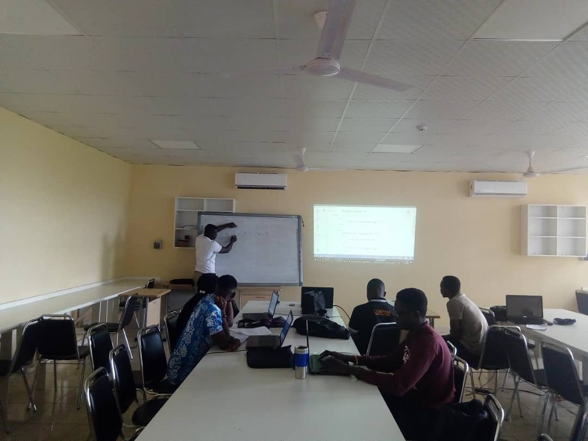
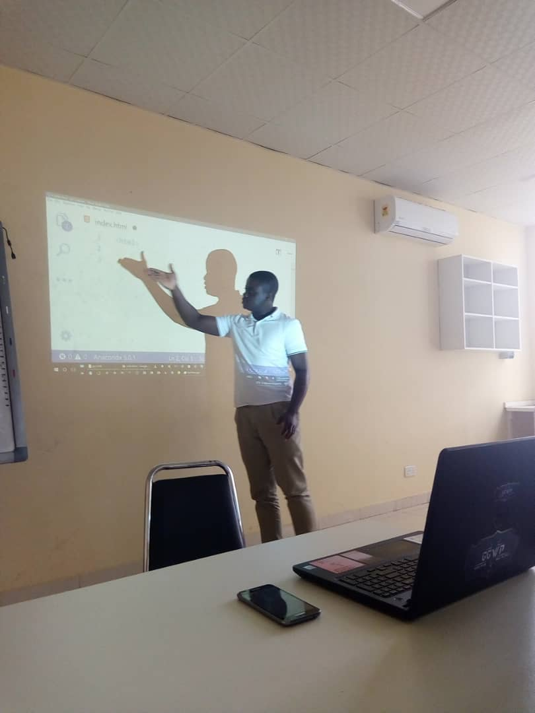
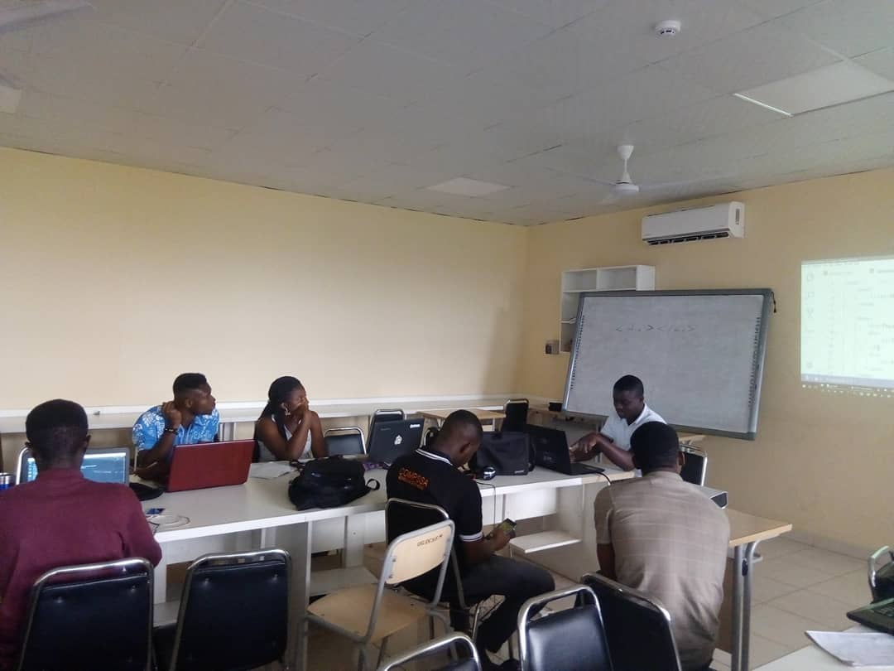

# @color[red](P)@color[yellow](y)@color[green](Club) UG
- Python User Group, University Of Ghana

---

@title[Pyclub UG]

#### Who we are

---?image=assets/img/img1.jpg

### @color[blue](What we do)

@ol

- We meet Every week to code
- Tutorial sessions with parallel varying Topics on software Development, web development, machine learning.
- We organise hackathons
- National Hacklabs with participants from Pyclub KNUST, PyClub UCC and all PyClubs from various institutions.

@olend

---
#### Images from our recent tutorial session

---

### @color[blue](Membership)
##### @color[yellow](Who can join?)
@ul

- Anyone
- Any Student of UG
- Interested in Programming and Software Development
- Interested in Python and related technologies
- [Join us here https://bit.ly/2Dcn8YO](https://bit.ly/2Dcn8YO)

@ulend

---

- Connect with Us:
    - twitter: @pyclubug
    - github: @pyclubug

- Send Us an Email:
    - pyclubug@gmail.com
    - pyclubug@pythongana.org

---